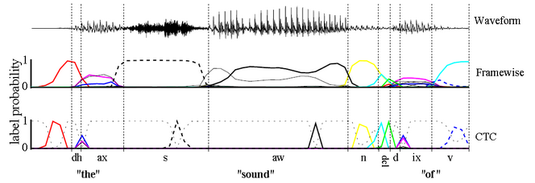

## 1.CTC应用
CTC全称Connectionist temporal classification,主要应用于基于时序的神经网络分类．常用于语音识别和图像识别中．传统的分类网络中，需要一个输入对应一个输出，而这在语音识别中确并不现实，一般多个帧才对应一个一个发音的label，在图像中识别一张图片中的一串数字，整个图片才对应这一串数字，这两个例子都有一个特点，那就是输入＞label．

